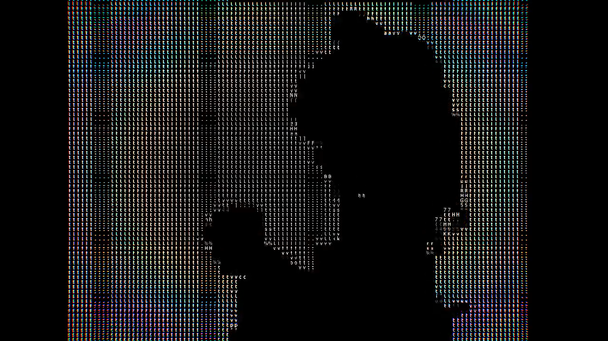
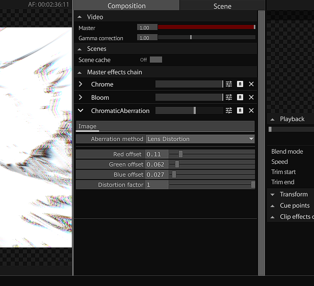

# Effects

Effects are post-production tools that are designed to manipulate visuals in real-time. Effects apply filters or enhancements to change the way an image is represented.

 
<small>A frame of Bad Apple, with ASCII and Chromatic Abberation applied.</small>

## Master effects chain

The master effects chain is the main effects pipeline of your project. Parameterized effects can be added onto the pipeline, affecting the video through a linear flow. Effects can be rearranged, customized, and automated.

To add an effect, navigate to the effects library (bottom-right panel), and drag your desired effect to the effects chain. The effect will be immediately applied, and you can customize it by clicking on the chevron to drop down its parameters.

 
<small>The master effect chain with listed effects.</small>

Each effect has its own dry/wet slider and alpha gate. The dry/wet slider determines the ratio between the dry (unprocessed) and wet (processed) signal. The alpha gate also determines if the effect is active or not. Turning the alpha gate off bypasses the effect, meaning it will not use any resources during runtime.

### Controls
* __Dry/wet__ - Adjust D/W
* __Lock__ - Preserve the effect as-is, disabling editing and deletion

## Effects library

All effects are stored in the '/effects' directory as Components. Each effect has its cooking set to false, as to not consume resources in the background. Effect cooking is automatically turned on once applied to an effects chain.

### Adding custom effects

To be recognised as an effect, it must have the operator tag 'effect'. The effect's input and output must be of a TOP type. You can copy an effects template from the '/templates/' folder. Add your custom effects to the '/effects' directory.

You can specify an effect's parameters to refer to an operator to use its parameters, instead of building them yourself. To do this, add a custom parameter to the effect, and name it 'Customparam'. Refer it to an OP, and the parameter page will refer to the operator instead of the effect itself once applied.
